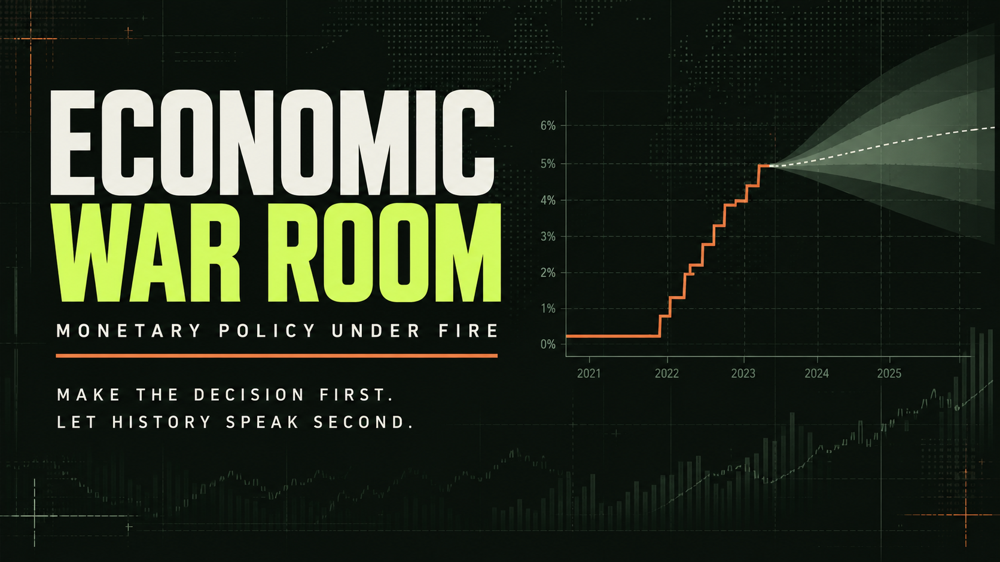

# Economic War Room

## Historical Monetary-Policy Simulator — Research Preview

**Created by Aayush Kadam**

Economic War Room is a vintage-aware historical monetary-policy simulation laboratory. The playable scenario places the user at seven 2022 FOMC meetings, restricts information to what was available at each decision date, records a policy choice, and reveals the historical decision afterward.

The engine evolves monthly PCE price changes, holds meeting rates until the next listed meeting, and compares the user's policy path with the dated historical baseline through documented literature-calibrated response kernels. Alternative outcomes are model-generated counterfactuals, not observations or causal estimates.

## What it is

Economic War Room is an educational and research-preview simulator for examining monetary-policy decisions under historically constrained information. It is designed to make assumptions, timing, data vintages, validation results, and failed experiments inspectable.

## Live demo

[Open the Economic War Room](https://economic-war-room-aayush.aayushonfleek.chatgpt.site/). The release deployment is currently owner-private and requires authorized ChatGPT access.

## Screenshots



Additional validation figures are preserved in [`reports/figures`](reports/figures/).

## The Fed 2022 scenario

The released scenario covers seven FOMC decisions from March through December 2022. Each briefing respects its decision-date information cutoff, initializes headline PCE inflation from twelve actual vintage monthly price flows, and keeps the historical policy choice hidden until the player commits.

## How decisions work

At each meeting, the player selects a rate action, communication stance, and policy memo. The engine holds the resulting target rate between meetings, advances the economy monthly, and records the path. The historical FOMC decision is then revealed for comparison; it is not treated as proof of an optimal choice.

## Vintage-data design

Scenario packets separate observation periods, release dates, and decision cutoffs. Official-source retrieval, manifests, checksums, transformations, and the exact PCE-flow initialization are documented in [`DATA_SOURCES.md`](DATA_SOURCES.md) and the data pipeline. Revised information is excluded from normal historical play when it was unavailable at the meeting date.

## Economic engine

Python and TypeScript consume the same monthly specification in [`engine/unified_spec.json`](engine/unified_spec.json). Player-minus-historical policy-path deviations feed literature-calibrated distributed-lag kernels for financial conditions, output, unemployment, and inflation. Seeded shocks produce simulation dispersion; the response kernels are not locally identified causal estimates.

## Validation summary

RMSE; the best recorded simple baseline is shown in parentheses.

| Evaluation | 1 month | 3 months | 6 months | 12 months |
|---|---:|---:|---:|---:|
| 2016–2019 core | 0.131 (0.170) | 0.263 (0.346) | 0.423 (0.506) | 0.726 (0.610) |
| 2020–2025 archived stress core | 0.198 (0.274) | 0.438 (0.651) | 0.780 (1.119) | 1.748 (2.016) |

The twelve-month pre-pandemic result is weaker than every recorded simple baseline. The stress-period comparison is archived evidence, not a claim of universal forecasting superiority. Live official-data refreshes can revise or extend observations, so they need not reproduce archived metrics bit-for-bit.

Full evidence is in `reports/R10_MODEL_SELECTION.md`, `reports/R10_STRESS_TEST.md`, `reports/R11_RELEASE_HARDENING.md`, `reports/R12_FINAL_UNCERTAINTY_AUDIT.md`, and `reports/UNCERTAINTY_VALIDATION_STATUS.md`.

## What did not work

- The original six-transition 2022 replay mixed incompatible timing and measurement conventions and failed against persistence.
- CPI-to-PCE initialization and synthetic equal monthly flows were scientifically inconsistent; both were replaced with exact vintage PCE histories.
- Energy augmentation and energy-plus-expectations augmentation lost the predeclared model-selection comparison to the parsimonious core.
- The core's twelve-month pre-pandemic forecast trails simple baselines.
- R11 adaptive intervals improved coverage but worsened the proper score.
- R12 rolling, exponentially weighted, and volatility-scaled conformal candidates all failed the frozen joint release gate.

These results remain part of the public audit trail.

## Scientific status

The supported claims and explicit nonclaims are frozen in [`docs/V0_9_SCIENTIFIC_CONTRACT.md`](docs/V0_9_SCIENTIFIC_CONTRACT.md). V0.9 is a research preview: it is reproducible, evidence-aligned software, but it is not independently research-reviewed or promoted as research-grade.

- Short- and intermediate-horizon validation of the mean inflation model is encouraging.
- In the archived 2020–2025 stress evaluation, the core mean model beats the recorded persistence, AR(1), and AR(4) baselines at every reported horizon.
- In the 2016–2019 test, the core beats those baselines at one, three, and six months, but not at twelve months.
- Policy transmission is literature-calibrated rather than locally structurally identified.
- Calibrated predictive intervals are **not claimed**. R11 and R12 uncertainty experiments failed their frozen joint calibration, sharpness, and proper-score gates; the complete negative evidence remains in the repository.
- The interface's shaded spread is simulation dispersion from stipulated stochastic shocks. It is not a confidence interval or a probability that the economy will fall inside the band.
- The software is not an optimal-policy calculator, causal model, forecasting oracle, or official Federal Reserve product.

## Reproducibility

Requirements: Python 3.11+, Node.js 22.13+, pnpm, and internet access to official FRED/ALFRED endpoints. No API key or developer-local data directory is required.

```powershell
pnpm install --frozen-lockfile
python scripts/fetch_official_data.py
python scripts/build_vintages.py
python calibration/build_frozen_sample.py
python calibration/estimate_parameters.py
python r10/run_r10_evaluation.py
python r11/run_uncertainty_repair.py
python scripts/build_parity_fixtures.py
python r12/run_r12_uncertainty.py
python -m pytest -q
pnpm test
pnpm build
pnpm start
```

Raw official observations and reconstructed calibration data are retrieved locally into ignored paths. The public package contains code, series metadata, provenance, transformations, derived initialization packets, and research outputs—not unresolved raw datasets.

See `docs/CLEAN_CLONE_REPRODUCTION.md`, `docs/DATA_LICENSING.md`, `METHODOLOGY.md`, `MODEL_SPECIFICATION.md`, and `LIMITATIONS.md`.

Fast continuous integration runs 80 fixture-backed Python tests, 10 browser/TypeScript parity tests, and the production build without calling official APIs. Four frozen-sample tests require the ignored reconstructed official-data file; those run as part of the full 84-test reconstruction workflow documented in [`docs/CLEAN_CLONE_REPRODUCTION.md`](docs/CLEAN_CLONE_REPRODUCTION.md).

## Installation

For a fixture-backed local verification:

```powershell
pnpm install --frozen-lockfile
python -m pytest -q
pnpm test
pnpm build
pnpm start
```

## Data sources

The principal sources are Federal Reserve FOMC calendars and statements, FRED/ALFRED observations, Bureau of Labor Statistics release archives, and Bureau of Economic Analysis PCE data distributed through FRED. See [`DATA_SOURCES.md`](DATA_SOURCES.md) for series-level provenance and [`docs/DATA_LICENSING.md`](docs/DATA_LICENSING.md) for handling rules.

## Limitations

- Twelve-month pre-pandemic mean-model performance trails simple recorded baselines.
- Monetary-policy transmission is literature-calibrated, not locally structurally identified.
- R11 and R12 predictive-interval methods failed the frozen release gates.
- Counterfactual results depend on the simulator's specification and welfare weights.
- Multi-country scenarios remain experimental and are not part of the V0.9 release contract.
- External validity is limited, and no independent economist review has yet justified V1.0.

See [`LIMITATIONS.md`](LIMITATIONS.md) for the complete record.

## Citation

Citation metadata are provided in [`CITATION.cff`](CITATION.cff). Please cite the software as “Economic War Room: Monetary Policy Under Fire,” version `0.9.0-research-preview`, by Aayush Kadam.

## Licence

Software is released under the [MIT License](LICENSE). Third-party data remain subject to their source terms.
