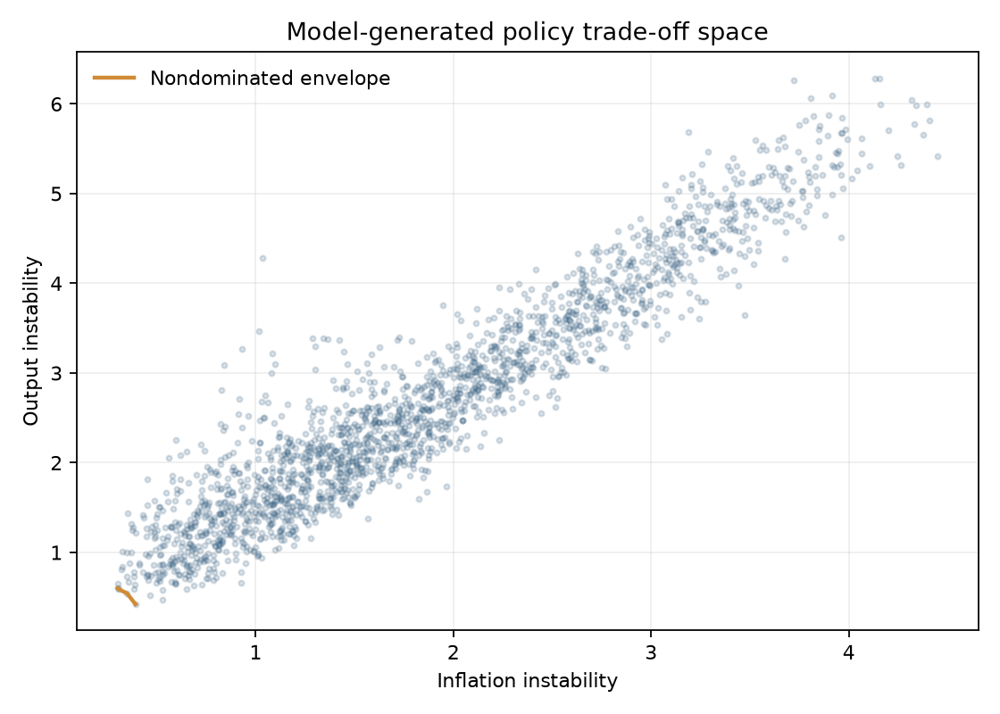

# Policy tournament and frontier

Seven rules operate on identical dated states and common seed schedules across 100 replications. The repaired formulas use partial adjustment toward rule targets. None reaches the 0% or 10% hard bound on the dated 2022 path, and the four designed rules produce distinct paths.

| Rule | Median total loss | Inflation loss | Output loss | Mean rate |
|---|---:|---:|---:|---:|
| historical | 4.01 | 1.08 | 2.43 | 2.38% |
| taylor | 3.92 | 0.78 | 2.42 | 3.07% |
| inflation focused | 5.60 | 1.09 | 3.51 | 3.43% |
| dual mandate | 2.56 | 0.59 | 1.48 | 2.58% |
| smoothing | 2.65 | 0.86 | 1.39 | 1.91% |
| hold | 9.38 | 3.66 | 5.48 | 0.13% |
| random | 6.66 | 2.57 | 3.72 | 0.61% |

The dual-mandate rule has the lowest median total loss under this particular simulator and loss function. That ranking is not a policy recommendation: objectives, coefficients, state measurement, and model structure determine it.

The frontier samples 2,000 constrained paths and identifies four nondominated points. It is a noisy model-generated envelope, not an estimated social optimum.

