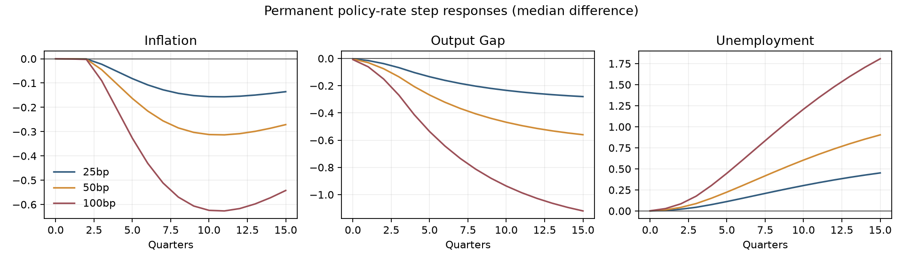

# Robustness and impulse-response report

## Verdict: PASS WITH LIMITATIONS

Policy IRFs use common random numbers over 4,000 paths. A tighter stance lowers output first, raises unemployment, and lowers inflation only after the distributed lag. The 27-case parameter grid produces an eight-quarter inflation median range of 1.83–2.09 and output range of -0.50–-0.22.

Student-t shocks change the 98% inflation interval from 1.99 to 2.11 percentage points. Parameter draws capture a limited subset of model uncertainty; they do not cover structural-form uncertainty.

The plotted rate experiments are permanent step responses, not one-period structural IRFs; a true policy-shock state with distributed lag memory remains open.

The stability run covers 27 parameter cases plus tournament/frontier/performance simulations. No NaN or infinite summary survived validation.
