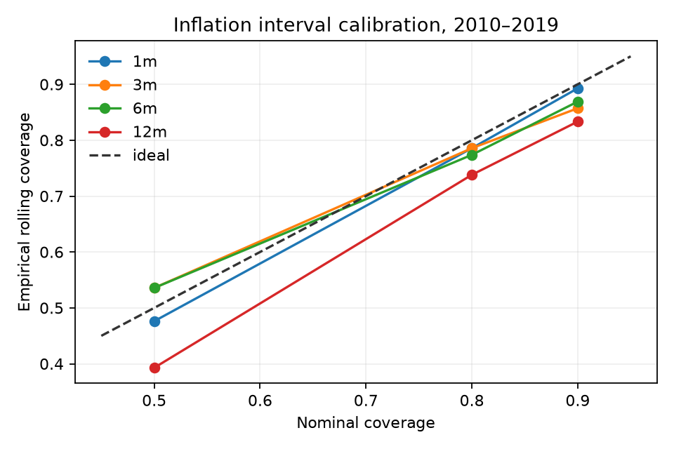

# Uncertainty calibration

Intervals are calibrated separately by horizon from signed errors at strictly earlier rolling origins. The first 24 origins are calibration-only; no future residual enters an interval. Quantiles are asymmetric when the prior error distribution is asymmetric.

| Horizon | 50% coverage | 80% coverage | 90% coverage |
|---|---:|---:|---:|
| 1 month | 47.6% | 78.6% | 89.3% |
| 3 months | 53.6% | 78.6% | 85.7% |
| 6 months | 53.6% | 77.4% | 86.9% |
| 12 months | 39.3% | 73.8% | 83.3% |

The maximum absolute calibration error is 10.7 percentage points, within the predeclared 15-point threshold. Twelve-month intervals are under-covered; the product must not describe these bands as exact probabilities outside the frozen evaluation design.

